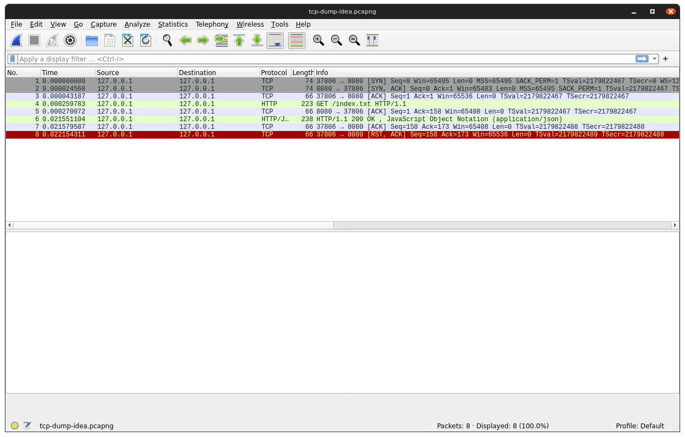
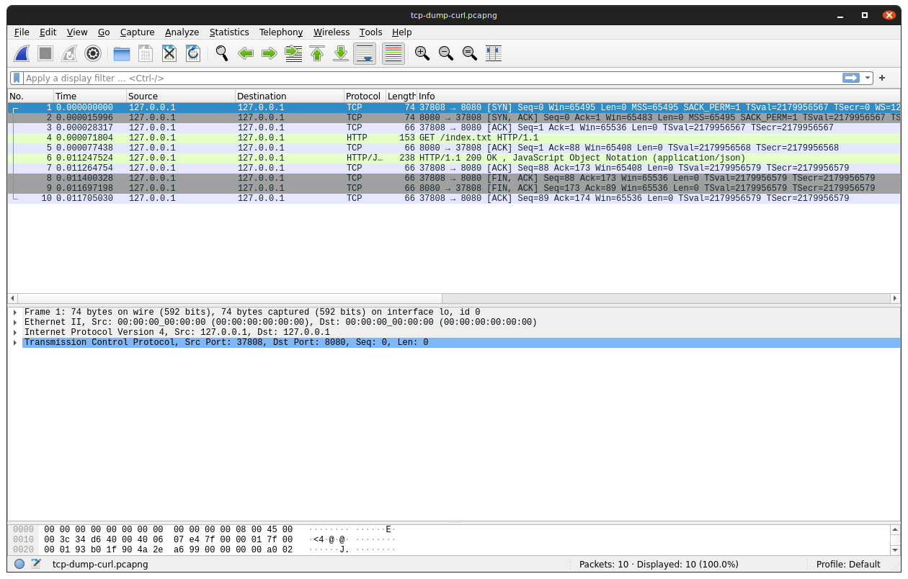

# Connection reset in IntelliJ Idea Http Client 

Using IntelliJ Idea Http Client (included in version 2021.3.2) causes 
'java.io.IOException: Connection reset by peer' error in micronaut 2.3.15/netty http server.

# TCP socket

It looks like TCP socket is not closed properly using [RST, ACK] sequence from http client.

In comparison, using curl shows correcly closed socket using [FIN,ACK],[FIN,ACK],[ACQ] sequence 

Wireshark captures are saved in wireshark folder.

# Apache HTTP Client investigation

I guess that Idea is reading content of the stream based on Content-Length HTTP header. TCP socket is not fully read
and closing HTTP client causes connection reset. I simulated this behavior in test HttpClientFailureTest.

Reading one more byte correctly closes TCP socket.

# Content
* src/main - sample micronaut http application
* src/test - simulations using HttpClient v.4.5.13 
* http - Idea Http Client file
* wireshark - tcp dump containg Idea and curl data
